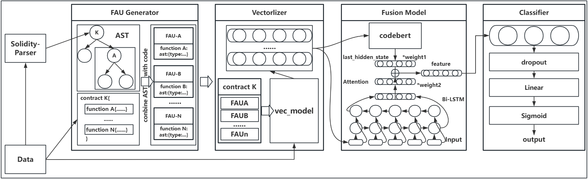

# SoliCheck: Smart Contract Vulnerability Detection Framework
## Overview of SoliCheck

## Background
Smart contracts are the bedrock of blockchain ecosystems, ensuring the secure and efficient operation of blockchain networks. However, the presence of vulnerabilities in these contracts can lead to substantial financial losses and undermine the integrity of the entire blockchain infrastructure.
## Shortcomings of Existing Tools

Traditional smart contract detectors rely on expert - made rules. They’re ineffective and can’t scale as the number of smart contracts grows. Neural - network - based methods show potential, yet a full understanding of smart contract features is missing.

## SoliCheck at a Glance

To overcome these limitations, we present SoliCheck, a novel framework designed to detect smart contract vulnerabilities. 
**Fusion Model**: SoliCheck leverages the power of Bidirectional Long Short - Term Memory (BiLSTM) networks and the pre - trained CodeBERT model. By combining these two technologies, SoliCheck can capture both sequential and semantic information in smart contract code.

**FAU Code Representation**: We introduce a novel code representation method called FAU. This approach integrates information from both the smart contract source code and its Abstract Syntax Tree (AST). As a result, SoliCheck can consider both the raw function code and its structural representation during the code analysis process.

## Evaluation Results

We tested SoliCheck on public datasets, comparing it with traditional and neural - network - based tools. SoliCheck achieved higher F1 scores than current top - performing methods. Ablation experiments also proved the effectiveness of its fusion model and code - understanding approach.SoliCheck combines advanced techniques to offer a more accurate and scalable way to secure blockchain ecosystems.

## Dataset
We use three datasets in this paper.  
[Dataset1](https://github.com/Messi-Q/Smart-Contract-Dataset)contains over 40,000 smart contracts.  
[Dataset2](https://github.com/Messi-Q/Smart-Contract-Dataset)contains about 1,200 labeled smart contracts.  
[Dataset3](https://figshare.com/articles/software/scvhunter/24566893/1?file=43154218)contains 300 labeled smart contracts.
